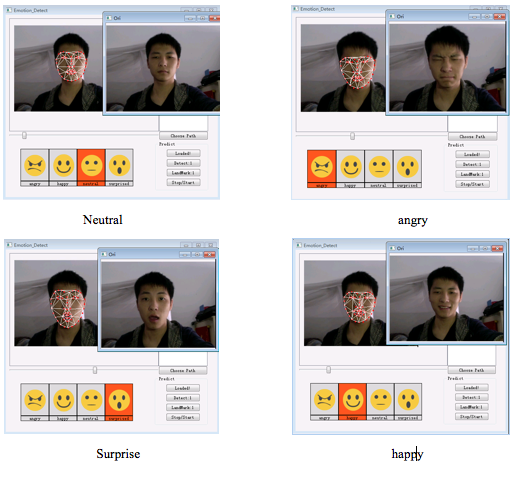

# Emotion_Recognition
Emotion Recognition Tools based on LandMark 

-obtain landmark with LBF model

-extract features with PCA+LDA

-classification wit SVM

-UI with QT5

Reference:
Face Alignment at 3000 FPS via Regressing Local Binary Features

http://www.jiansun.org/papers/CVPR14_FaceAlignment.pdf
